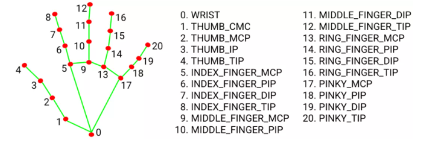

# 手部姿态识别脚本

*by KeRenquan. 2025/5/5*

# 部署建议

**Python 3.9 recommended.**

## 使用虚拟环境

*推荐使用 Conda 管理 python 版本和虚拟环境，也可以参考下面使用venv命令：*

### Mac and Linux

```shell
python3 -m venv .venv && source .venv/bin/activate
```

Then, install the requirements.txt as follows:

```shell
(.venv)$ pip install -r requirements.txt
```

### Windows

```ps1
python -m venv .venv
.\.venv\Scripts\activate
```

## 安装依赖

>*推荐使用校园网 python 镜像源，参考 <https://mirrors-help.osa.moe/pypi/>*
>
>```sh
>python -m pip install -i https://mirrors.osa.moe/pypi/web/simple --upgrade pip
>pip config set global.index-url https://mirrors.osa.moe/pypi/web/simple
>```

运行：

```sh
(.venv)> pip install -r requirements.txt
```

## 运行项目

To launch the demo script:

```sh
(.venv)$ python dexhand-ble.py
```

## FAQ

### 数据含义



- 对于图像输出，内容包括一组17个数据：包括食指（idx）中指（mid）无名指（rng）大拇指（tmb）手腕（wst）。其中手指手腕均包含俯仰角、偏摆角；5根手指额外包括指关节弯曲度。共17个主要关节。

- 对于端口输出，可以在 127.0.0.1:8666 获取 json 格式组织的文本数据。内容包括 **side - 左右手；pose - 姿势分类；points - 手部关键节点序列；angles - 主要关节角度序列。**

    其中关节角度具体含义如下（序号: 含义）：
  - $0:180-\angle0,5,6$
  - $1:90-\angle9,5,6$
  - $2:360-\angle5,6,7-\angle6,7,8$
  - $3:180-\angle0,9,10$
  - $4:\angle5,9,10-90$
  - $5:360-\angle9,10,11-\angle10,11,12$
  - $6:180-\angle0,13,14$
  - $7:\angle9,13,14-90$
  - $8:360-\angle13,14,15-\angle14,15,16$
  - $9:180-\angle0,17,18$
  - $10:\angle13,17,18-90$
  - $11:360-\angle17,18,19-\angle18,19,20$
  - $12:180-\angle1,2,4$
  - $13:60-\angle2,1,5$
  - $14:180-\angle2,3,4$
  - $15:180-\angle\alpha$      *($\alpha=平面0,1,5与平面0,5,17夹角$)*
  - $16,17:手腕俯仰角、偏摆角$

- 对于终端输出，内容包括进程开始、结束提示，TCP服务器运行日志，基本报错信息。打开终端输出选项后还可见与端口输出一样格式的文本内容，主要用于调试。
